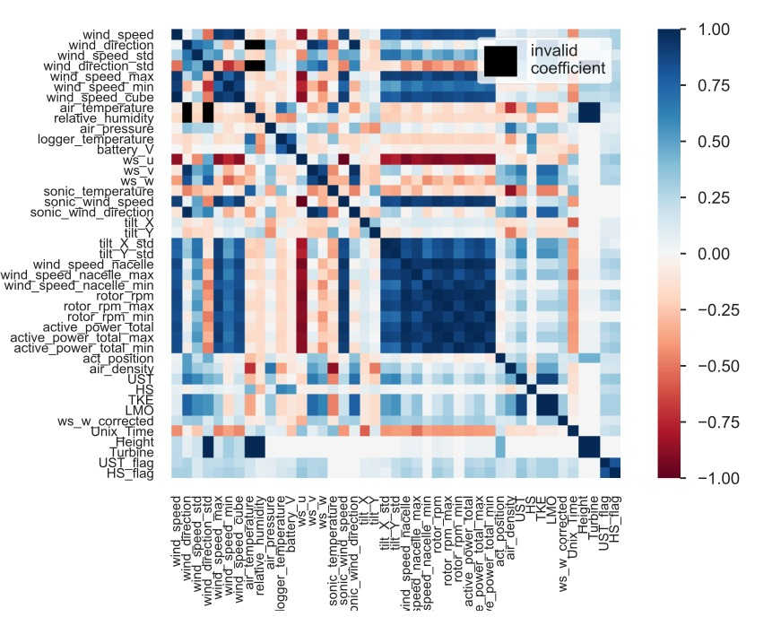

# Wind Turbine Energy Prediction

This repository contains the materials of the term project Wind Turbine Energy Prediction of Renewable Energy Systems University of Tuebingen. 

## **Quick Start**
For the quick start you can reproduce the results of the project by running the following Colab links below.

**Beberibe Colab**  --> 

**Kelmarsh Colab**  --> 

**Code Documentation** --> 

----

## **Introduction**

This project focuses on generating accurate predictions for wind energy production from two distinct wind farms. The forecasts are required for three time intervals: the next 10 minutes, the next hour, and the next day. To ensure high-quality results and meet the project's objectives, gradient boosted trees are employed in conjunction with Bayesian hyperparameter optimization. Additionally, feature engineering techniques and data imputation methods are utilized to enhance the accuracy of the predictions.

## **Datasets**

 Datasets are provided for two different wind farms. One of them is located in Beberibe, Brazil and the other one is located in Kelmarsh, UK. 
 
 The Brazilian data compilation comprises two sets of information gathered during a micrometeorological study conducted in two separate wind farms situated in a coastal region of northeastern Brazil. The wind farms in question are named Pedra do Sal Wind Farm (UEPS) and Beberibe Wind Farm (UEBB). These farms are positioned along the northeast coast of Brazil, an area characterized by meteorological conditions heavily impacted by trade winds and sea breeze. Each dataset encompasses measurements collected continuously over the course of an entire year, specifically from August 2013 to July 2014. Dataset can be downloaded from [Beberibe Wind Farm](https://zenodo.org/record/1475197#.ZD6iMxXP2WC).

UK dataset encompasses information related to the Kelmarsh wind farm in the UK. It includes a KMZ file for easy visualization in tools like Google Earth, as well as static data providing turbine details and coordinates. Additionally, it offers 10-minute SCADA and events data for the six Senvion MM92 turbines at Kelmarsh wind farm, organized by year from 2016 to mid-2021. The dataset, provided by Cubico Sustainable Investments Ltd under a CC-BY-4.0 open data license. Dataset can be downloaded from [UK Wind Farm](https://zenodo.org/record/5841834#.ZEajKXbP2BQ).

## **Exploratory Data Analysis**

Exploratory Data Analysis (EDA) plays a crucial role in understanding and extracting insights from datasets. One powerful tool for conducting EDA is the pandas profiling library.It automates the process of generating comprehensive reports on the dataset, providing insights into its structure, statistical measures, and data quality. The reports include information on data types, missing values, correlations, distributions, outliers, and more. By using pandas profiling, analysts can efficiently identify patterns, anomalies, and data quality issues, facilitating informed decision-making in data preprocessing and modeling

EDA was performed on both datasets using the pandas profiling library. The generated reports can be found in the reports folder. Based on the reports, fields with a high number of missing values were removed, while the remaining missing values were either filled using backward filling or mean imputation methods. Fortunately, the UK dataset providers have already prepared a set of useful columns for analysis out of the original 300 columns [1]. Nevertheless, a profile check was conducted, revealing minor issues that were addressed. Additionally, correlations between the features were examined, and features with high correlation are set to be discarded (TBD). The visualization below showcases the correlation for the UEBB dataset.

<!-- resize the image and center -->

## **Feature Engineering**

**TBD**

## **Modeling**

## **Results**

## **References**

[1]: "Hobbit lifestyles"
